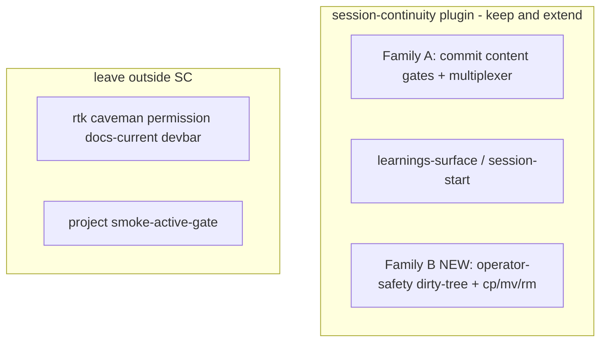

# Hooks sprawl evaluation

> **For agentic workers:** evaluation + ownership plan for Claude Code hooks
> across global settings, this plugin, and consuming projects. Implementation
> of remediations is a follow-on; this doc locks *where* and *who owns*.

**Repo:** [`talgolan/session-continuity`](https://github.com/talgolan/session-continuity)
(local: `~/active_development/TG/session-continuity-plugin`).

Proven-gate: N/A — evaluation / ownership plan; no live-path claim.
Evidence-gate: N/A — evaluation / ownership plan; no live-run claim.
Smoke: N/A — no binary/engine/container work in this plan.

**Goal:** Stop whack-a-mole hook growth. Classify hooks by kind, lock ownership
(this plugin owns product gates *and* new operator-safety family), and rank
remediations. **Do not** create a separate mega-hooks project.

**Driving incident:** architect-workbench #122 — advisory `learnings-surface`
missed `git reset --hard` (bad LEARNINGS `Trigger:` tool tag) → wiped
uncommitted work. Advisory reminder alone failed under pressure; needs a
blocking gate in the right family/matcher.

---

## Core questions

1. Which hooks are / should be universal (global)?
2. Where are those hooks owned and managed?
3. From which project do we initiate the fix? (**Answer locked below.**)

Whack-a-mole read: most gates grew from one incident each (claim-wording gate,
smoke wording, dirty reset, `cp -i` hang, …) without a single owner or
universality rule. Fix = classify by *kind*, then put each kind in one managed
home — not another one-off script.

---

## Where to initiate (decision locked)

**Primary project:** this repo — `session-continuity-plugin`
(`talgolan/session-continuity`).

**Not:** a new project. **Not:** architect-workbench as the home for the gates
(only companion LEARNINGS `Trigger:` sweep + smoke-sentinel check live there).

| Work item | Initiate in |
|-----------|-------------|
| Ownership doc (two families) | **this plugin** |
| Dirty-tree PreToolUse gate (#122) | **this plugin** |
| Bare `cp`/`mv`/`rm` deny (engrim #43) | **this plugin** |
| Commit-gate multiplexer | **this plugin** |
| LEARNINGS `Trigger:` sweep | architect-workbench (project data only) |
| Smoke sentinel still written? | architect-workbench (verify only) |

Open Cursor / Claude against **this checkout** for the actual fix.

---

## Clarification — do NOT move existing session-continuity hooks out

**No.** Not recommending a new mega-plugin that absorbs this plugin's gates.

Stay here (release cycle already works):

- commit content gates (claim / smoke / evidence / …)
- learnings-surface
- session-start / prompt-intercept
- multiplexer refactor (same plugin)

What was wrong before: treating "needs a managed home" as "must leave
session-continuity," *or* stuffing **non-commit** shell safety onto the
`git commit *` matcher.

**Because this plugin is globally enabled, preferred home for new
operator-safety gates = same plugin**, as a **separate hook family**
(matcher: Bash broadly, or specific destructive patterns — **not**
`git commit *`). One repo, one release, no second project.

Still leave outside this plugin:

- rtk / caveman / permission / context-mode-heal / docs-current-check / devbar —
  tool-owned or personal UX; absorbing them = new sprawl inside the plugin
- project `smoke-active-gate` — consuming-repo / smoke-plugin concern
- real git post-commit — stays git

**Anti-pattern:** new separate "hooks plugin" that duplicates or relocates
session-continuity. Adds a project; does not remove moles.



---

## Three Claude Code layers (what actually fires)

```mermaid
flowchart TB
  subgraph events [Per tool / session event]
    PTU[PreToolUse]
    SS[SessionStart]
    UPS[UserPromptSubmit]
    Stop[Stop]
  end
  subgraph global [Global ~/.claude/settings.json]
    G1[devbar capture x many events]
    G2[rtk-rewrite Bash]
    G3[engrim hook/assist/log/sync]
    G4[caveman activate+tracker]
    G5[context-mode-cache-heal]
    G6[docs-current-check Stop]
    G7[permission.js]
  end
  subgraph plugin [session-continuity plugin]
    P1[session-start]
    P2[prompt-intercept]
    P3["8x git commit gates + pre-commit-check"]
    P4[learnings-surface Bash and Write/Edit]
  end
  subgraph project [consuming project .claude]
    R1[smoke-active-gate Bash]
  end
  PTU --> G1
  PTU --> G2
  PTU --> P3
  PTU --> P4
  PTU --> R1
  SS --> G1
  SS --> G3
  SS --> G4
  SS --> G5
  SS --> P1
  UPS --> G1
  UPS --> G3
  UPS --> G4
  UPS --> P2
  Stop --> G1
  Stop --> G3
  Stop --> G6
```



### Layer A — Project (`.claude/settings.json` in consuming repos)

| Hook | Event | Decision | Role |
|------|-------|----------|------|
| `smoke-active-gate.sh` | PreToolUse `Bash` | **deny** if sentinel + mutating docker/kill/rm | Protect live smoke run |

No-op when sentinel file absent. Stay project-scoped (or eventually smoke-test-plugin).

### Layer B — Global (`~/.claude/settings.json`)

- **Telemetry (devbar):** many events, matcher `*` where applicable. Cost unknown
  (not in this plugin's perf log).
- **Safety / UX:** `permission.js`; `rtk-rewrite.sh` (Bash PreToolUse).
- **Memory / mode:** engrim SessionStart/Stop/Submit; caveman; context-mode cache heal.
- **Doc hygiene:** `docs-current-check.sh` on Stop (LEARNINGS bleed into `claude -p`
  drafts unless `--safe-mode` / equivalent isolation).

**Pending (engrim #43, not shipped):** PreToolUse deny for bare `cp`/`mv`/`rm`
hitting interactive aliases — same *class* as dirty-tree; **ship in Family B
here**, not as another unmanaged `~/.claude/hooks/` file.

### Layer C — this plugin (`hooks/hooks.json`)

| Hook | Event / if | Decision | Inspects |
|------|------------|----------|----------|
| `session-start.sh` | SessionStart | inject | primer / peers / version |
| `prompt-intercept.sh` | UserPromptSubmit | inject/block matched slash cmds | prompt text |
| `pre-commit-check.sh` | `Bash(git commit *)` | advisory | staged names vs primer |
| `flaky-gate.sh` | same | **deny** | commit msg + LEARNINGS |
| `proven-gate.sh` | same | **deny** | specs/plans claims |
| `smoke-gate.sh` | same | **deny** | plan smoke wording |
| `evidence-gate.sh` | same | **deny** | specs/plans smoke design |
| `backend-parity-gate.sh` | same | **deny** | plan backends |
| `occurrence-gate.sh` | same | **deny** | LEARNINGS occurrence |
| `derived-value-gate.sh` | same | **deny** | `commands/*.md` |
| `learnings-surface.sh` | Bash + Write\|Edit | advisory only | LEARNINGS `Trigger:` vs payload |

### Adjacent

- Real git hooks in consuming repos (version bump) — different mechanism.
- Cursor `~/.cursor/hooks.json` — separate runtime; do not conflate.
- Other plugins with hooks (context-mode, deep-research, superpowers) — footnote unless conflict.

---

## Perf evidence (architect-workbench `.session-continuity/performance.log`, ~26k lines)

| Hook (logged name) | Fires | Avg | Max | Notes |
|--------------------|------:|----:|----:|-------|
| learnings-surface | 11525 | 61ms | 4.8s | every Bash + Write/Edit |
| session-start | 712 | 493ms | 11.5s | SessionStart |
| 7 deny gates + pre-commit-check | ~1–2k each | ~88–173ms | ~6s | each commit |

**Per `git commit` Bash call (avg, sequential):** ~0.85–0.91s from this plugin
alone (8 staged scanners + learnings-surface). Worst-case spikes (~6s × 7 gates)
theoretically tens of seconds.

**Root redundancy (confirmed in gate sources):** every deny gate calls
`gate_scan_staged` independently → separate process × `git diff --cached` ×
per-file `git show` / diff. Path-set overlap: LEARNINGS (flaky + occurrence);
specs/plans (claim-gate + evidence); plans (smoke + backend-parity + claim/evidence
when under those dirs). **Logic is not duplicate; I/O is.**

---

## Evaluation findings

1. Sprawl is real and layered by intent, not accidental duplication of the same check.
2. **Cost center #1:** N PreToolUse processes per `git commit`, each re-scanning the index → multiplexer in this plugin.
3. **Cost center #2:** `learnings-surface` volume; Trigger-tag hygiene is load-bearing (#122 failure mode).
4. **Severity mismatch:** irreversible data-loss ops still advisory-or-absent at PreToolUse. Family B blocking gates are the right *kind* of fix; wrong to hang them off `git commit *`.
5. Keep project `smoke-active-gate`; confirm sentinel still written before removal talk.
6. Trigger audit in consuming LEARNINGS: shell-command entries must use `Bash`, not `Edit`.
7. Bleed risk: global Stop/UserPromptSubmit hooks inherit into draft `claude` spawns — do not "fix" sprawl by disabling globals that drafts rely on isolation for.

---

## 1) Universal vs local

**Universal** = fires in every Claude Code session on the machine (any cwd), unless a project overrides.

| Kind | Examples | Should stay universal? |
|------|----------|------------------------|
| Operator shell safety | (none blocking yet; dirty-tree + bare `cp/mv/rm` **proposed as Family B**) | **Yes — ship from this plugin when globally enabled** |
| Shell rewrite / UX | rtk, permission | Yes (personal ergonomics; leave tool-owned) |
| Memory / mode | engrim, caveman | Yes (personal; leave tool-owned) |
| Telemetry | devbar | Yes if desired; leave org/tooling |
| Stop hygiene | docs-current-check | Debatable; keep isolation for drafts |
| Plugin product gates | Family A commit gates + learnings-surface + session-start | Universal while plugin enabled globally |

**Not universal (correctly local):** project smoke-active-gate; real git post-commit; Cursor hooks.

**Missing universal (gap):** dirty-tree deny; bare `cp`/`mv`/`rm` deny — Family B in this plugin, **not** `git commit *` matcher.

---

## 2) Where owned and managed

| Layer | Runtime wire | Script home | Actual owner today | Problem |
|-------|--------------|-------------|--------------------|---------|
| Global settings | `~/.claude/settings.json` | `~/.claude/hooks/*` | **Unmanaged local files** (home git excludes them) | No tracked SoT for personal UX wiring |
| Global binaries | same | devbar app, `~/.local/bin/engrim` | Vendor / pipx | Fine |
| Auto-dropped into `~/.claude/hooks/` | settings refs | caveman, rtk, context-mode heal | Upstream copies | Copy drift; settings hand-edited |
| **session-continuity** | plugin `hooks/hooks.json` | **this repo** → marketplace → cache | **This repo** | Healthy — extend here |
| Project | `.claude/settings.json` | consuming repo `.claude/hooks/` | Consuming repo | Healthy for repo-specific |
| Cursor | `~/.cursor/hooks.json` | Cursor | Separate runtime | Do not conflate |

**Punchline:** only well-managed hook *product* is this plugin. Unmanaged `~/.claude/hooks/` still messy for personal UX — **do not** invent a second hooks product to fix that. For safety gates (#122, #43), ship Family B from here.

**Target ownership:**

| Kind | Manage in | Ship by |
|------|-----------|---------|
| Operator shell safety (dirty-tree, `cp/mv/rm`, …) | **this plugin — Family B** | Plugin release |
| Commit gates / surface / session-start | **this plugin — Family A** | Plugin release (multiplexer = Family A) |
| Personal UX (rtk, permission, caveman, engrim wiring) | Leave tool-owned / `~/.claude/hooks/` for now | Do **not** absorb |
| Telemetry (devbar) | Org/tooling | Leave outside |
| Smoke sentinel gate | consuming repo or smoke-test-plugin | Repo/plugin PR |
| Version bump | consuming repo git-hook installer | Already |

---

## Recommended remediations (ranked)

- [ ] **0. Document two hook families** in plugin README/ROADMAP: (A) product/continuity, (B) operator-safety — both ship from this plugin when globally enabled.
- [ ] **1. Dirty-tree PreToolUse** (Family B, Bash/destructive matcher, **not** `git commit *`). Deny destructive git when tree dirty. Escape hatch env var.
- [ ] **2. Bare `cp`/`mv`/`rm` deny** (Family B, same wave as 1). Message: bypass local `-i` alias via `\` or `command`.
- [ ] **3. Trigger-tag sweep** in consuming-project LEARNINGS — shell entries must say `Bash`, not `Edit`.
- [ ] **4. Multiplexer** for existing `git commit *` gates — one process, one staged scan, then all Family A checks. Cuts ~7× git I/O.
- [ ] **5. Optional later:** narrow learnings-surface early-exit; measure again from perf log.

---

## Work sequence

1. Confirm ownership model (this plugin owns Family B; no new hooks project) — **locked**.
2. Ownership note in plugin docs (remediation 0).
3. Implement remediations 1–2 (and 4 when picked) in this repo.
4. Companion: LEARNINGS `Trigger:` table + smoke-sentinel check in architect-workbench.
5. Release plugin version; consumers pick up via marketplace auto-update / cache.

---

## Confirm commands

```bash
# This plugin hooks
jq '.hooks' hooks/hooks.json

# Active cache (version may differ)
jq '.hooks' ~/.claude/plugins/cache/talgolan/session-continuity/*/hooks/hooks.json

# Perf by hook name (in a consuming project that logs)
jq -r 'select(.source=="hook")|[.name,.duration_s]|@tsv' .session-continuity/performance.log \
  | awk -F'\t' '{s[$1]+=$2;c[$1]++} END{for(k in s) printf "%s avg=%.3f n=%d\n",k,s[k]/c[k],c[k]}'
```
